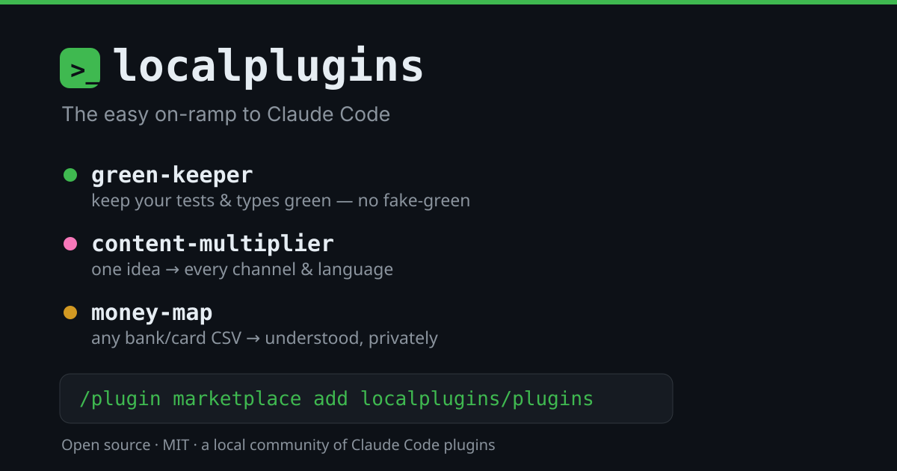

# 🔌 localplugins

**The easy on-ramp to Claude Code.** Add the marketplace, install one, run it on a real task — and you're off. Open source and community-built: most run entirely on your machine; **docpin** fetches library docs from the web (always cited), and **brand-forge** can optionally call an image API for AI graphics (its default vector engine is local).

> **Why we made these:** to help more people get comfortable in Claude Code and find more day-to-day uses for it. So we packaged the workflows we live in into a few plugins to get you started.

## ⚡ Get started in 30 seconds

In a Claude Code session, add the marketplace once:

```
/plugin marketplace add localplugins/plugins
```

Install any of the five, then reload:

```
/plugin install green-keeper@localplugins
/plugin install content-multiplier@localplugins
/plugin install money-map@localplugins
/plugin install docpin@localplugins
/plugin install brand-forge@localplugins
/plugin install cv-forge@localplugins
/reload-plugins
```

That's it.

<details>
<summary><b>📦 Using the desktop app instead? →</b></summary>

1. Open the **Code** tab and pick a project folder.
2. Click **+** next to the message box → **Plugins** → **Manage plugins**.
3. **Marketplaces** tab → **Add marketplace** → paste `localplugins/plugins` → approve the trust prompt.
4. **Discover** tab → choose a plugin → **User** scope → **Install**.
5. Type `/reload-plugins` to activate.
</details>

## 🧩 What you get

| | Plugin | What it does | Try first |
|:-:|---|---|---|
| 🟢 | **green-keeper** | Keeps your tests & types green while you code — and never fakes a pass | `/green` |
| ✍️ | **content-multiplier** | Turns one idea into a week of on-brand content, across channels & languages | `/multiply` |
| 💸 | **money-map** | Makes sense of any bank/card CSV — categorized, summarized, anomalies flagged | `/understand` |
| 📚 | **docpin** | Grounds Claude in docs matched to your installed library versions | `/docs` |
| 🎨 | **brand-forge** | Generates on-brand logos, social templates & marketing graphics from a saved brand profile | `/brand-new` |
| 📄 | **cv-forge** | Turns one JSON résumé into an ATS-friendly PDF, in the template that fits you | `/cv-new` |

### 🟢 green-keeper — keep your code green
After the AI writes code, it fixes what's red with a *minimal* change and re-runs to prove it — and won't let a session end with newly-introduced red. **No fake-green:** it never skips a test or silences an error to pass.

- `/green-setup` · point it at your test + typecheck commands
- `/green` · fix failing tests and type errors, minimally
- `/cover` · write behavioral tests for what you just changed

### ✍️ content-multiplier — one idea, every channel
Turn a post, transcript, or idea into on-brand drafts for every channel — and translate/transcreate into other languages.

- `/brand-setup` · capture your voice & rules once
- `/multiply` · one source → drafts everywhere
- `/campaign` · plan a themed, multi-piece campaign
- `/localize` · adapt into other languages
- `/review` · brand + compliance check on any draft

### 💸 money-map — understand your money, privately
Hand it any bank or card CSV export and get a plain-English picture — categorized transactions, a cash-flow summary, and flagged anomalies (a duplicate charge, a sub that crept up). The math is real code, not guesses.

- `/money-setup` · set your category rules once
- `/understand` · CSV → categorized summary + anomalies
- `/reconcile` · match two statements or accounts
- `/clean` · tidy a messy export
- `/report` · plain-English summary for a period

### 📚 docpin — code against your installed versions
Claude's library knowledge is frozen at its training cutoff, so it writes code against APIs that are outdated — or too new — for what you actually have installed. docpin reads your lockfiles, resolves each package's installed version, and fetches the docs for *that* version (npm, PyPI, crates.io, Go) — so Claude codes against your real API, with a citation every time.

- `/docs <library> [topic]` · version-matched docs for any dependency
- `/docs-scan` · which of your dependencies docpin can resolve docs for
- `/docs-setup` · one-time config (cache, hook, defaults)

### 🎨 brand-forge — on-brand visuals on demand
Save a visual brand profile (palette, type, logo, tone) once, then generate on-brand logos, social templates, and marketing graphics that match it every time. The vector engine runs entirely on your machine; AI imagery is opt-in.

- `/brand-new` · create a visual brand profile (guided)
- `/brand-make` · generate on-brand SVG assets — logos, social, docs
- `/brand-status` · show the active kit
- `/brand-use <slug>` · switch brands in a multi-brand repo
- `/brand-export` · rasterize an SVG to PNG

### 📄 cv-forge — one résumé file, an ATS-ready PDF
Keep your résumé as one versioned `resume.json` (JSON Resume), then render it through an HTML/CSS template and Print → Save as PDF in your browser. No Node, no API keys, no network — the whole happy path runs on your machine.

- `/cv-new` · create `resume.json` (import an existing résumé or answer guided questions)
- `/cv-make` · render the active résumé + template to `output/`
- `/cv-status` · show the active résumé, template, and section counts
- `/cv-use <slug>` · switch templates and re-render

## 🔒 What runs where
Open source and MIT. **green-keeper, content-multiplier, money-map, and cv-forge run entirely on your machine** — no accounts, no API keys, no network, no telemetry; each reads only the files you point it at and writes results back locally. **docpin** is the exception by design: it fetches documentation from public package registries and doc hosts (npmjs.org, pypi.org, crates.io, proxy.golang.org, docs.rs, pkg.go.dev, GitHub) on demand, and cites the exact version and URL every time — still no accounts and no API keys. **brand-forge**'s vector engine also runs entirely on your machine; its AI-image engine is opt-in — off by default, reaching the network only when you enable it with your own provider key.

> Plugins need Claude Code (CLI or desktop) — they don't run in the plain Claude chat app.

## 💬 Say hi
Ideas, questions, or a plugin that chokes on your data? **localplugins@proton.me** — or [open an issue](https://github.com/localplugins/plugins/issues).
