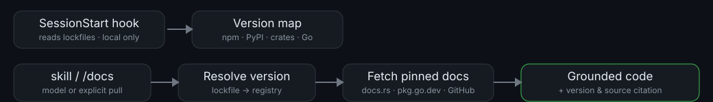

# docpin



**Claude codes against YOUR installed version, not its training cutoff.**

## The problem

A model's knowledge of a library is frozen at its training cutoff. Left to
itself, it writes code against APIs that are **outdated** (removed since the
cutoff) or **too new** (not yet in the version your project actually pins).
"Latest docs" tooling doesn't fix this either — a repo pinned to `react@17`
while `react@19` is latest still gets code for the wrong version.

docpin's job is narrower and sharper: **version-matched** documentation. Not
latest — the docs for the exact version in your lockfile.

## Requirements

- Claude Code.
- A POSIX-compatible shell (`/bin/sh`) for the SessionStart hook.
- Internet access — docpin fetches documentation from public package
  registries and doc hosts on demand (see [Privacy](#privacy)).

## Installation

```
/plugin marketplace add localplugins/plugins
/plugin install docpin@localplugins
```

That's it — no API key, no account, no config required to start.

## Usage examples

**1. Just code (npm/React).** Ask Claude to use a library the normal way —
docpin's skill triggers automatically before Claude writes or explains code
that imports a third-party npm, PyPI, crates.io, or Go package, and grounds
the answer in docs for the version actually installed in your project.

```
> why does my useEffect cleanup run twice in dev mode?
```

docpin resolves `react` from `package-lock.json` (`18.2.0`), fetches the
version-pinned docs, and answers against that version specifically —
double-invocation in development is documented Strict Mode behavior in
`react@18`, not a bug — instead of a generic answer that might describe `17`
or `19` behavior instead:

```
Source: react@18.2.0 — https://raw.githubusercontent.com/facebook/react/v18.2.0/README.md
```

**2. Explicit pull with a topic (npm).** `/docs <library> [topic]` fetches
docs for one library right now, optionally narrowed to a topic:

```
/docs zod refine
```

docpin resolves `zod` from your lockfile (e.g. `3.22.4`) and distills just the
`.refine()` section rather than the whole README:
`Source: zod@3.22.4 — https://raw.githubusercontent.com/colinhacks/zod/v3.22.4/README.md`

**3. Python/PyPI.** Same command, different ecosystem — docpin detects PyPI
from `requirements.txt`/`poetry.lock`/`pyproject.toml` the same way it
detects npm from `package.json`:

```
/docs fastapi dependency injection
```

`fastapi@0.111.0` (locked) supports this via `Depends()` in a path-operation
function signature. `Source: fastapi@0.111.0 — https://raw.githubusercontent.com/fastapi/fastapi/0.111.0/docs/en/docs/tutorial/dependencies/index.md`

**4. Rust/crates.io.** crates.io has a native version-pinned doc host
(docs.rs), so this recipe skips the GitHub round-trip entirely:

```
/docs serde deserializer
```

`serde@1.0.196` (locked) — the `Deserializer` trait defines `deserialize_*`
methods. `Source: serde@1.0.196 — https://docs.rs/serde/1.0.196/serde/trait.Deserializer.html`

**The SessionStart version map.** Every session start, a local hook scans
your lockfiles/manifests and injects a compact summary so Claude already
knows what's installed before you ask:

```
docpin active — grounding library code against your installed versions.
npm:  react@18.2.0, next@14.1.0, zod@3.22.4, …(+12 more)
PyPI: fastapi@0.111.0, pydantic@2.7.1, httpx@0.27.0
```

**`/docs-scan` — coverage report.** A fast, read-mostly report over your
project's dependencies, showing which docpin can resolve version-pinned docs
for, without fetching a single full doc page:

```
npm:  react 18.2.0 ✓ · next 14.1.0 ✓ · left-pad 1.3.0 fallback (closest available)
PyPI: fastapi 0.111.0 ✓ · pydantic 2.7.1 ✓
Summary: 5 scanned — 4 ✓, 1 fallback, 0 ✗
```

## Commands

| Command | Args | Purpose |
|---|---|---|
| `/docs` | `<library> [topic]` | Explicit pull of version-matched docs for one library, optionally narrowed to a topic (method, option, concept). |
| `/docs-scan` | none | Coverage report over the project's direct dependencies — which ones docpin can resolve version-pinned docs for, without fetching full doc pages. |
| `/docs-setup` | none | Detects the project's ecosystems and writes/updates `.docpin/config.json` (cache, hook, and default-ecosystem settings). |

## Agents & skills

- **`docpin` skill** (`skills/docpin/SKILL.md`) — the model-invoked entry
  point; triggers before Claude writes or explains code that imports a
  third-party library and runs the resolve → fetch → ground loop. Its
  `references/` hold the detail it delegates to: `resolver.md` (core
  algorithm + fallback chain), the four `ecosystem-*.md` recipes (lockfile
  parsing, registry calls, doc-URL templates), `output-contract.md`
  (distillation, citation, honesty rules), and `caching.md` (cache format).
- **`doc-fetcher` agent** — runs the resolve → fetch → distill loop for one
  library in an isolated context, so a heavy multi-hop lookup (unfamiliar
  registry, deep topic, several fallback attempts) doesn't spend the main
  session's context on raw registry JSON and fetched pages. Returns only the
  distilled, cited answer.
- **`citation-guardian` agent** — verifies a grounded answer before it's
  trusted, especially for load-bearing code: re-resolves the version from the
  lockfile independently, confirms the cited URL resolves and is the
  version-pinned form, confirms cited symbols genuinely appear in that
  version's docs, and checks that any fallback is labeled honestly.

## How it works

docpin runs a **resolve → fetch → ground** loop: detect which ecosystem a
file belongs to from its nearest lockfile/manifest, resolve the concrete
installed version (locked from a lockfile, or inferred from a manifest range
and labeled as such), look up the registry to confirm that version and find
its docs/repo URL, fetch the actual documentation pinned to that exact
version, then distill only what's relevant and cite the version and URL(s)
used. If a requested symbol isn't in that version's docs, it says so instead
of guessing.

This runs in two layers. A **local, network-free SessionStart hook**
(`hooks/session-start.sh`) reads lockfiles/manifests only and injects a
compact version-map summary at session start — cheap, always-on context so
Claude already knows what's installed. **On-demand fetches** (the skill
triggering mid-conversation, or `/docs`) are the only layer that reaches the
network, and only for the specific library/version/topic actually being
asked about.

## Supported ecosystems & how each resolves

| Ecosystem | Lockfiles/manifests | Native version-pinned docs |
|---|---|---|
| npm (JS/TS) | `package-lock.json`, `pnpm-lock.yaml`, `yarn.lock`, `bun.lock(b)`, `package.json` | GitHub tag / unpkg |
| PyPI (Python) | `poetry.lock`, `uv.lock`, `Pipfile.lock`, `requirements*.txt`, `pyproject.toml` | Read the Docs / GitHub tag |
| crates.io (Rust) | `Cargo.lock`, `Cargo.toml` | `docs.rs` |
| Go modules | `go.mod`, `go.sum` | `pkg.go.dev` |

- **npm** — in a monorepo/workspaces setup, resolution is relative to the
  workspace nearest the file in focus, not the repo root's lockfile, since
  workspaces can pin different versions of the same package. Scoped packages
  (`@scope/name`) look up at `registry.npmjs.org/@scope%2Fname`
  (URL-encoded) and tag the same way as unscoped packages.
- **PyPI** — three manifest shapes need different handling: PEP 621
  `pyproject.toml`, Poetry's own table, and plain `requirements*.txt`. Only a
  lockfile or an exact `==` pin counts as locked; a bare `>=`/`^` range is
  inferred. Extras (`fastapi[all]`) and environment markers
  (`; python_version >= "3.9"`) don't change which version is resolved.
- **crates.io** — docs.rs hosts native per-version docs, so most lookups skip
  GitHub entirely. An expanded sub-table (`[dependencies.serde]` with a
  `version` key) resolves the same as inline `serde = "1.0"` — both read from
  `Cargo.lock`.
- **Go** — a module can export several importable sub-packages; docpin uses
  the sub-package's own import path (e.g. `.../gin@v1.9.1/binding`), not just
  the module root, when that's what's imported. Module tags are always
  `v`-prefixed (`v1.9.1`, not `1.9.1`).

## Configuration

Run `/docs-setup` to detect your project's ecosystems and write
`.docpin/config.json` (project-local, git-ignored). docpin works with zero
setup — these are the defaults applied even if you never run it:

```json
{
  "cache": { "enabled": true, "dir": ".docpin/cache" },
  "hook": { "enabled": true, "maxDeps": 40 },
  "defaultEcosystem": null
}
```

- `cache.enabled` — cache distilled docs on disk, keyed by
  `<ecosystem>/<pkg>@<version>[/topic]`, so repeat lookups skip the network.
- `hook.enabled` — turn the SessionStart version-map hook on/off.
- `hook.maxDeps` — cap on dependencies listed per ecosystem in the hook
  output.
- `defaultEcosystem` — disambiguates a bare library name that exists in more
  than one ecosystem in your project (`"npm"`, `"pypi"`, `"crates"`, or
  `"go"`).

## Privacy

Everything docpin does over the network is in service of one thing: the quality of
its work and the reliability of its process. Its requests exist to resolve the right
installed version, fetch the documentation that matches it, and ground accurate,
cited answers — improving what it produces and how it produces it. It reaches public package registries (npmjs.org,
pypi.org, crates.io, proxy.golang.org) and public documentation hosts (docs.rs,
pkg.go.dev, GitHub, Read the Docs), strictly on demand, only for packages your project
actually uses, and cites every source by URL so you can verify it yourself. What leaves
your machine is only those lookups for public docs — the same pages you'd open in a
browser; your code, your files, and your data stay local.

docpin requires no API key and creates no account. It
reads your lockfiles/manifests locally to figure out what to fetch, and
caches distilled docs in a project-local `.docpin/` directory (git-ignored)
that you can delete or disable at any time.

## FAQ / troubleshooting

**"The version it used looks wrong."** Check whether your project has a
lockfile, and whether the package is actually pinned in it — without one,
docpin resolves a manifest range to the latest satisfying version and labels
it *inferred*, which can differ from what's really installed if you haven't
reinstalled recently. Run `/docs-scan` to see exactly what was resolved.

**"No lockfile, or it's a monorepo."** No lockfile just means every version
is inferred, not locked — docpin still works and labels the basis honestly.
In a workspaces layout, resolution is relative to the workspace nearest the
file in focus; if that's ambiguous, it asks, or set `defaultEcosystem` via
`/docs-setup`.

**"It's a private/unpublished package."** The registry lookup fails outright.
docpin falls back to the locally installed copy's bundled docs (a `README`
in `node_modules/<pkg>`, `dist-info`, a vendored crate), labeled
*local bundled* — never presented as an exact version-pinned match.

**"I'm offline."** Every step past reading your lockfiles needs the network.
Offline, docpin says it can't resolve or fetch rather than guessing from
training data. A cache hit from an earlier session still works offline.

**"The docs host 404s at my exact version."** Each ecosystem recipe in
`references/resolver.md` has a fallback step (e.g. crates.io's
`docs.rs/<crate>/latest/`, npm's `unpkg.com` mirror). The answer says
*closest available (\<v\>)* rather than silently substituting.

**"How do I turn off the SessionStart hook?"** Run `/docs-setup` and set
`hook.enabled` to `false` in `.docpin/config.json`. The hook only ever reads
local lockfiles/manifests; disabling it just removes the automatic
version-map summary — `/docs` and the skill still work normally.

**"Does it send my code anywhere?"** No. docpin reads lockfiles/manifests
locally to decide what to fetch — your source code, files, and data never
leave your machine. The only network traffic is public doc requests for the
library/version being looked up, same as opening those pages in a browser.
See [Privacy](#privacy) for the exact scope.

**"Why not just ask Claude directly?"** Claude's built-in library knowledge
is frozen at its training cutoff and has no way to know which version your
project actually has installed. docpin resolves *your* installed version
from *your* lockfile and cites the documentation for that exact version.

## Uninstall

```
/plugin uninstall docpin@localplugins
```

Optionally remove the local cache and config:

```
rm -rf .docpin/
```
