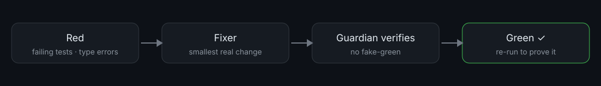

# Green Keeper

[](https://www.claudepluginhub.com/plugins/localplugins-green-keeper-green-keeper?ref=badge)



**Keeps your tests and types green while you code — and won't let you walk away from red.** No fake-green: it never weakens a test or hides an error just to make things pass.

## What it does

Green Keeper is a Claude Code plugin that treats "green" as a promise that the code is actually correct. It gives you three commands and a set of guardrails:

- **Fix red, for real.** `/green` finds every failing test and type/compile error, fixes each with the smallest correct change, and re-runs until the suite and types genuinely pass.
- **Cover what you changed.** `/cover` writes behavioral tests for your new code and proves each one fails on the old code and passes on the new — so the test actually exercises the change.
- **Stay honest automatically.** A Stop hook watches for red that *your turn* introduced and drives it back to green before the turn can end. A session-start status line tells you whether you're starting clean.

The distinguishing rule is the one it refuses to break: it will not skip a test, loosen an assertion, add `@ts-ignore`, widen a type to `any`, or pad coverage to turn red into green. A dedicated reviewer (`green-guardian`) inspects every change and rejects the cheat if it sees one. Red that needs a human or product decision is reported as red — never disguised as green.

Everything runs locally. Green Keeper has no network access, no accounts, and no telemetry — it only runs the test and type-check commands you configure.

## Requirements

Claude Code (CLI or desktop). A project with a test and/or type-check command — green-keeper auto-detects them, or you set them in `.green-keeper/config.json`. The automatic hooks run on Claude Code or OpenCode.

## Installation

Green Keeper runs inside **Claude Code** (the CLI or the desktop app). You install it from a plugin marketplace and drive it by typing commands like `/green` at the Claude Code prompt.

1. **Add the marketplace** (once):

   ```
   /plugin marketplace add localplugins/plugins
   ```

2. **Install the plugin:**

   ```
   /plugin install green-keeper@localplugins
   ```

3. **Reload so the commands, agents, and hooks register:**

   ```
   /reload-plugins
   ```

4. **Configure it for your repo:**

   ```
   /green-setup
   ```

   This detects your test and type-check commands, shows them to you, and writes `.green-keeper/config.json` after you confirm.

5. **Ignore the state directory.** Add `.green-keeper/state/` to your `.gitignore`. Keep `.green-keeper/config.json` in version control so your team shares the same commands.

**Requirements & compatibility.** You need Claude Code (CLI or desktop) to use the commands, agents, and skills. The **automatic hooks** (session-start status, the Stop-hook red check, the opt-in typecheck) run on hosts that support Claude Code's hook system — Claude Code and OpenCode. On hosts without hook support you still get the commands, agents, and skills; you just run them yourself instead of the Stop hook nudging you. The hooks also require `bash` and `jq` on your PATH.

## Usage examples

You run Green Keeper by typing a command at the Claude Code prompt. Claude does the work — reading failures, editing code, re-running your suite — using Green Keeper's agents and skills.

### 1. Fix a failing test

**Situation.** You changed a pricing function and a test now fails.

**You type:**

```
/green
```

**What happens.** Claude reads `.green-keeper/config.json`, runs your type-check and test commands, and collects the red. For each failure it hands the item to the `fixer` agent, which forms a hypothesis about the *root cause* and makes the smallest correct change — to production code if the code is wrong, or to a genuinely-wrong test if the test is wrong. The `green-guardian` agent then inspects the diff and confirms nothing was skipped, silenced, or loosened. Claude re-runs the suite and type-check to prove they pass.

**Outcome.** The test passes because the bug is fixed, not hidden. You get a short report: the root cause and the minimal change for each item.

### 2. Cover new code with real tests

**Situation.** You just wrote a `parseDuration` helper and haven't tested it.

**You type:**

```
/cover src/time/parseDuration.ts
```

(Omit the path to cover your whole uncommitted diff.)

**What happens.** The `test-writer` agent finds your test framework and where sibling tests live, then writes behavioral tests — asserting real outputs and edge cases, not that a mock was called. The `green-guardian` runs **revert-verification**: it confirms each new test *fails* against the pre-change code and *passes* with your change. A test that passes on the un-changed code proves nothing, so it gets rewritten.

**Outcome.** You get tests that would actually catch a regression, placed where your other tests live, with a note on which behaviors are now covered.

### 3. Automatic catch when a turn introduces red (the Stop hook)

**Situation.** You asked Claude to refactor a module. Along the way an edit broke a test — and the refactor looked done.

**What happens.** When Claude tries to end the turn, Green Keeper's **Stop hook** runs your quick test and type-check. It sees red that wasn't there when the session started (the baseline was green), so it blocks the turn from ending and tells Claude to run the `/green` workflow: fix with a minimal change, no fake-green, and re-run until green. It retries up to `maxAttempts` times, then yields so it can never trap you.

**Outcome.** The regression is fixed before the turn ends — you never silently walk away from red your own turn introduced. Red that was already there when the session began is left alone (the status line flagged it), so the hook never nags about problems you didn't just create.

### 4. Set up (or re-detect) commands in a new repo

**Situation.** Fresh clone; Green Keeper doesn't know how to run anything yet.

**You type:**

```
/green-setup
```

**What happens.** Using the `runner-detection` skill, Claude inspects `package.json`, `pyproject.toml`, `go.mod`, `Cargo.toml`, `Makefile`, and CI config to infer your `test`, `typecheck`, and a fast `quickTest` command. It shows you the commands and asks you to confirm before saving (these run automatically via hooks). Then it writes `.green-keeper/config.json` and does a quick sanity run to report whether the repo currently starts green or red. Pass overrides if detection guesses wrong:

```
/green-setup --test "pnpm test" --typecheck "tsc --noEmit" --quick "vitest run --changed"
```

**Outcome.** A committed config your whole team shares, and the hooks now know how to check green on every session.

## Commands

| Command | Arguments | What it does |
| --- | --- | --- |
| `/green` | `[test\|types\|all]` (default `all`) | Detect all red, fix each with a minimal real change via `fixer`, have `green-guardian` reject any fake-green, then re-run to prove green. Scope to just tests or just types with the argument. |
| `/cover` | `[file-or-path...]` (default: your uncommitted changes) | Write/update behavioral tests for changed code via `test-writer`, then have `green-guardian` revert-verify each test fails on the old code and passes on the new. |
| `/green-setup` | `[--test <cmd>] [--typecheck <cmd>] [--quick <cmd>]` | Detect and cache your test + typecheck commands to `.green-keeper/config.json` (with confirmation), then sanity-check green/red. |

## Agents & skills

Green Keeper splits the work across focused subagents, each governed by a skill that encodes the rules.

**Agents**

- **`fixer`** — Turns one red item green. Reads the failure, forms a root-cause hypothesis, makes the smallest correct change (never touching unrelated or generated files), and re-runs to confirm. If it can't find a genuine fix, it stops and reports what's blocking rather than faking it. Governed by `anti-fake-green`.
- **`green-guardian`** — The judge. It writes no fixes; it decides whether a change is a real fix or a cheat. It inspects the diff for skipped/weakened tests and silenced errors, runs revert-verification, and re-runs the checks. When unsure, it rejects and explains — it never rubber-stamps. Governed by `anti-fake-green` and `test-quality`.
- **`test-writer`** — Writes behavioral tests for changed code, matching the repo's framework and layout, then revert-verifies that each test actually exercises the change. Governed by `test-quality` and `anti-fake-green`.

**Skills**

- **`anti-fake-green`** — Defines exactly what counts as fake-green (skipping, weakening assertions, silencing errors, widening to `any`, padding coverage) and the revert-verification procedure that proves a fix is real. This is the rule the whole plugin is built to enforce.
- **`runner-detection`** — How to figure out a repo's test and type/compile commands across Node/TS, Python, Go, Rust, and Make-based projects, how to pick a fast `quickTest`, and the exact config schema to write.
- **`test-quality`** — What makes a test worth having: behavioral assertions over implementation details, critical path then real edge cases, narrowest assertion, deterministic, and named for the behavior it checks.

## Configuration

Green Keeper reads `.green-keeper/config.json` at the repo root. `/green-setup` writes it for you; you can also edit it by hand. Commit this file so your team shares the same commands.

| Field | Type | Required | Default | Meaning |
| --- | --- | --- | --- | --- |
| `test` | string | yes | — | Full test command, run by `/green` and `/cover`. |
| `typecheck` | string | yes | — | Type/compile check command (e.g. `tsc --noEmit`, `mypy .`, `go build ./...`, `cargo check`). |
| `quickTest` | string | no | falls back to `test` | Fast subset run by the hooks on every turn/session. Keep it quick. |
| `enforce` | boolean | no | `true` | When `true`, the Stop hook blocks a turn from ending on newly-introduced red. Set `false` to make the hook report-only. |
| `maxAttempts` | number | no | `3` | How many times the Stop hook re-blocks to push a fix before it yields and leaves the red for you. |
| `postToolUseTypecheck` | boolean | no | `false` | Opt-in: after each `Write`/`Edit`/`MultiEdit`, run the typecheck and surface new type errors as a note (report-only, never blocks). |

**Example — a TypeScript project:**

```json
{
  "test": "npm test",
  "typecheck": "tsc --noEmit",
  "quickTest": "vitest run --changed",
  "enforce": true,
  "maxAttempts": 3,
  "postToolUseTypecheck": false
}
```

**Example — a Python project with fast feedback on edits:**

```json
{
  "test": "pytest",
  "typecheck": "mypy .",
  "quickTest": "pytest -q -k affected",
  "enforce": true,
  "maxAttempts": 2,
  "postToolUseTypecheck": true
}
```

The plugin also keeps a `.green-keeper/state/` directory (a `baseline` file recording whether the session started green, and an `attempts` counter for the Stop hook). Add `.green-keeper/state/` to `.gitignore` — it's per-machine and not meant to be shared.

## Automatic enforcement & the no-fake-green rule

Three hooks provide the automatic behavior. All are exit-code driven, run only the commands you configured, and touch the network zero times.

- **SessionStart** — On a real session start or resume (not on every context compaction), it records a **baseline**: is the repo green or red right now? It resets the Stop-hook attempt counter and injects a status line. If you start red, it says so and promises the Stop hook won't nag about that pre-existing red. If there's no config yet, it tells you to run `/green-setup`.
- **Stop** — When Claude tries to end a turn, this runs your `quickTest` and `typecheck`. It blocks the turn only when **all** of these hold: there's red, `enforce` is on, and the baseline was green (so the red is *new* this session). It nudges Claude into the `/green` workflow with an explicit no-fake-green reminder, up to `maxAttempts` times, then yields — so it drives fixes without ever trapping you. Pre-existing red and red while `enforce` is off are reported to stderr, not blocked.
- **PostToolUse** — Opt-in via `postToolUseTypecheck: true`. After a `Write`/`Edit`/`MultiEdit`, it runs the typecheck and, if the edit introduced type errors, surfaces the last few lines as a note. It's report-only and can't block.

**The no-fake-green guarantee.** Green Keeper's whole value is that green stays trustworthy. Every fix flows through `green-guardian`, which rejects a change if it:

- skips, deletes, comments out, or `.skip`/`.only`/`xit`/`xdescribe`/`@pytest.mark.skip`s a test;
- loosens or removes an assertion (e.g. `toEqual` → `toBeTruthy`);
- silences an error (`@ts-ignore`, `eslint-disable`, `# type: ignore`, empty `catch {}`, `except: pass`);
- widens a type to `any`/`unknown`/`object` just to clear an error;
- pads coverage with tests that assert nothing or only exercise mocks; or
- edits a test to match buggy behavior when the *production code* is what's wrong.

For fixes, it revert-verifies that undoing the production change reproduces the failure. For new tests, it revert-verifies each fails on the old code and passes on the new. If something genuinely can't be made green — because it needs a human or product decision — Green Keeper says so plainly. Faking green is treated as worse than leaving red, because it hides the bug.

## How it works

1. `/green-setup` inspects your project (`runner-detection`) and caches `test`, `typecheck`, and `quickTest` to `.green-keeper/config.json`.
2. The **SessionStart** hook runs those commands by exit code, records a green/red baseline, and shows a status line.
3. When you run `/green`, Claude detects red, dispatches each item to `fixer` (minimal real change under `anti-fake-green`), runs it through `green-guardian`, and re-runs the full suite and type-check to prove green.
4. When you run `/cover`, `test-writer` writes behavioral tests (`test-quality`) and `green-guardian` revert-verifies each one against the pre-change code.
5. The **Stop** hook re-checks quick green at turn-end and, if your turn introduced red on a clean baseline, blocks and drives a fix — up to `maxAttempts`, then yields.
6. If `postToolUseTypecheck` is on, the **PostToolUse** hook gives you type-error feedback right after each edit.

## Uninstall

```
/plugin uninstall green-keeper@localplugins
```

## FAQ / troubleshooting

**The Stop hook keeps blocking and won't let the turn end.**
It blocks only on *newly-introduced* red, up to `maxAttempts` (default 3), then yields on its own. If you want it to stop pushing, either fix the red (run `/green`), set `"enforce": false` in `.green-keeper/config.json` to make it report-only, or lower `maxAttempts`. It never blocks red that was present when the session started.

**It started blocking after I opened a session on an already-broken repo.**
It shouldn't — the SessionStart hook records the repo as red at baseline and the Stop hook won't nag about pre-existing red. If it does block, your baseline file may be stale; the next real session start (or resume) re-records it. You can also delete `.green-keeper/state/baseline` to force a fresh read.

**The hooks don't seem to run at all.**
Check three things: (1) you ran `/reload-plugins` after installing; (2) `.green-keeper/config.json` exists (no config means the hooks no-op) — run `/green-setup`; (3) `bash` and `jq` are on your PATH, since the hook scripts use them. Also note hooks only run on hosts with Claude Code hook support (Claude Code, OpenCode).

**Detection picked the wrong test or typecheck command.**
Re-run setup with explicit overrides: `/green-setup --test "<cmd>" --typecheck "<cmd>" --quick "<cmd>"`, or edit `.green-keeper/config.json` directly. Choose a genuinely fast `quickTest` — it runs on every turn end and session start.

**Can I use just the commands without the automatic hooks?**
Yes. On any host, `/green`, `/cover`, and `/green-setup` work on demand. The hooks are the automatic layer; without hook support you simply run the commands yourself.

**Security note.** The hooks execute the `test` and `typecheck` command strings from `config.json` automatically via the shell at session start and turn end. Review `config.json` like any other executable project file — a change to these commands carries the same trust as a change to `package.json` scripts or a `Makefile`. Green Keeper never accesses the network; it only runs the commands you configure.
