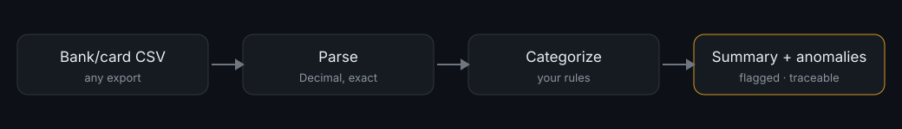

# money-map

[](https://www.claudepluginhub.com/plugins/localplugins-money-map-money-map?ref=badge)



**Point Claude at any bank or card CSV export and finally understand your money** — every transaction categorized, cash flow summarized, and anomalies flagged, all on your machine.

## What it does

money-map is a Claude Code plugin that reads a CSV export from your bank or credit card and turns it into something you can actually read: a categorized transaction list, a plain-English cash-flow summary, and a short list of things worth a second look (duplicate charges, unusually large expenses, recurring charges that changed).

The part that matters most: **the numbers are real.** Every total, percentage, and average is computed by a deterministic Python toolkit using `Decimal` arithmetic — not estimated by the model — and each figure traces back to the specific rows it came from. Rows that can't be parsed, or transactions that don't match any category rule, are surfaced for you to resolve rather than quietly dropped or guessed.

Everything runs locally on files you already have. money-map never links to your accounts, asks for credentials, or touches the network.

## Requirements

Claude Code (CLI or desktop). A bank or card statement exported as CSV. No bank connection, accounts, or network.

## Installation

money-map runs inside **Claude Code** — either the CLI or the desktop app. You'll type its commands (`/understand`, `/reconcile`, etc.) at the Claude Code prompt, not in a separate program.

1. Add the marketplace:

   ```
   /plugin marketplace add localplugins/plugins
   ```

2. Install the plugin:

   ```
   /plugin install money-map@localplugins
   ```

3. Reload so the commands register:

   ```
   /reload-plugins
   ```

4. Run first-time setup (creates your category rules and confirms how your export's columns map):

   ```
   /money-setup path/to/a-sample-export.csv
   ```

That's it. Your rules live in `money/categories.json` in your working directory; results are written to `money/output/`.

## Usage examples

Everything below happens **inside Claude Code**. You type a slash command; money-map's agents run the deterministic toolkit and write results to `money/output/`, then Claude summarizes what it found in the chat. The fenced blocks are illustrative examples of input CSVs and output summaries, not a separate app.

### 1. Understand a month's export

You exported March from your checking account and want to know where the money went.

```
/understand ~/Downloads/checking-march.csv
```

Say the file looks like this:

```csv
Date,Description,Amount
2026-03-01,PAYROLL ACME INC,4200.00
2026-03-02,WHOLE FOODS MARKET #123,-86.44
2026-03-03,NETFLIX.COM,-15.99
2026-03-05,SHELL OIL 574,-52.10
2026-03-06,BLUE BOTTLE COFFEE,-6.75
2026-03-15,RENT - MAPLE PROPERTIES,-2100.00
```

money-map detects the column mapping (a single signed `Amount` column, `%Y-%m-%d` dates), applies the rules in `money/categories.json`, and runs the toolkit end to end (`parse_report` → `categorize` → `aggregate` → `anomalies`). The `figures-guardian` agent then checks every number reconciles before anything is shown. You get a summary like:

```
March 2026 — 6 transactions, 2026-03-01 to 2026-03-15

Income      $4,200.00
Expenses    $2,261.28
Net         +$1,938.72

By category:
  Rent           $2,100.00   (92.9% of spend)
  Groceries         $86.44   (3.8%)
  Transport         $52.10   (2.3%)
  Subscriptions     $15.99   (0.7%)
  Uncategorized      $6.75   (0.3%)   ← BLUE BOTTLE COFFEE

Uncategorized (1): BLUE BOTTLE COFFEE  -$6.75
  Propose rule: (?i)blue bottle → Dining ?
```

Written to `money/output/checking-march/`: `categorized.csv` (every row with its category), `report.md` (the summary), and `anomalies.md`. Claude also lists the uncategorized coffee charge and proposes a rule for you to approve.

### 2. Set up category rules for your data

You want dining out to stop landing in Uncategorized, and to add rules for the merchants you actually use.

```
/money-setup ~/Downloads/checking-march.csv
```

money-map reads the header and a few sample rows, shows you the detected column mapping to confirm, then creates `money/categories.json` from the starter template and tailors it to what it saw in your file. Rules are ordered most-specific-first, since the first matching rule wins. You end up with entries like:

```json
{
  "categories": ["Income", "Groceries", "Dining", "Transport", "Rent", "Subscriptions", "Uncategorized"],
  "rules": [
    { "match": "(?i)blue bottle|coffee|restaurant", "category": "Dining" },
    { "match": "(?i)whole foods|trader joe|safeway", "category": "Groceries" },
    { "match": "(?i)shell|chevron|uber|lyft",        "category": "Transport" },
    { "match": "(?i)netflix|spotify|hulu",           "category": "Subscriptions" },
    { "match": "(?i)rent|maple properties",          "category": "Rent" }
  ]
}
```

You can edit this file by hand anytime, and commit it to version control to share the same rules with a team. Every future `/understand` and `/clean` run uses it.

### 3. Reconcile two statements

Your bookkeeping export and your bank export should agree for the quarter. You want to see exactly what's missing or extra on each side.

```
/reconcile ~/Downloads/books-q1.csv ~/Downloads/bank-q1.csv
```

money-map parses both files and runs the toolkit's `reconcile(a, b)`, which matches each transaction in file A to the first unused transaction in file B with an **equal amount** and a **date within 3 days** (to absorb posting-date lag). It reports three buckets:

```
Reconciliation — books-q1.csv (a) vs bank-q1.csv (b)

Matched: 128 of 130

Only in books (2):
  2026-02-14  -$49.00  "Domain renewal"       ← recorded, not on bank
  2026-03-30  -$12.50  "Bank fee (accrued)"   ← recorded, not yet posted

Only in bank (1):
  2026-03-31  -$35.00  "SERVICE CHARGE"       ← on bank, not in books
```

The `figures-guardian` confirms the counts add up (matched + only_in_a = total in A), so you know nothing was silently dropped from either side. Now you know exactly which three rows to investigate.

### 4. Clean a messy export

You have two exports in different layouts — one uses a single signed `Amount` column, the other uses separate `Debit`/`Credit` columns — and a few junk rows. You want one tidy, categorized file.

```
/clean ~/Downloads/card.csv ~/Downloads/checking.csv
```

Say the second file uses debit/credit columns and has one bad row:

```csv
Date,Description,Debit,Credit
01/05/2026,COSTCO WHOLESALE,142.30,
01/06/2026,REFUND - RETURN,,25.00
01/07/2026,GARBLED ROW,142.30,25.00
```

money-map parses each file through `Decimal` (debit becomes a negative outflow, credit a positive inflow), categorizes with your rules, and writes a single `categorized.csv` with consistent columns (date, description, amount, category, account, source-file). The ambiguous third row — both debit *and* credit populated — is flagged, not guessed:

```
Cleaned 2 files → money/output/clean/categorized.csv (247 rows)

Skipped 1 row (surfaced, never dropped):
  checking.csv line 4: row has both debit and credit populated (ambiguous)
    01/07/2026  GARBLED ROW  Debit=142.30  Credit=25.00
```

You get the tidy file plus an honest list of what couldn't be parsed, so you can fix those rows at the source.

## Commands

| Command | What it does | Argument |
|---|---|---|
| `/money-setup` | Create `money/categories.json` and confirm your export's column mapping. Run once to start. | `[path-to-sample.csv]` (optional) |
| `/understand` | **The hero.** Categorize an export, summarize cash flow, and flag anomalies. Writes `categorized.csv`, `report.md`, `anomalies.md`. | `<path-to-export.csv>` |
| `/reconcile` | Match two record sets by amount + near date and list every mismatch. | `<file-a.csv> <file-b.csv>` |
| `/clean` | Turn one or more messy/multi-format exports into a single tidy, categorized file. | `<path-or-paths.csv>` |
| `/report` | Produce a shareable spending / cash-flow summary from analyzed data. | `<path-or-output-folder>` |

## Agents & skills

Two subagents do the work, split so that the thing computing the numbers is never the thing checking them:

- **`analyst`** — analyzes one export. It detects the column mapping, then runs the toolkit (`parse_report` → `categorize` → `aggregate` → `anomalies`) and writes the plain-English narrative. It never does the arithmetic itself; it reports what the `Decimal` toolkit returns, surfaces skipped and uncategorized rows, and proposes (never assumes) new category rules.
- **`figures-guardian`** — the final check before any output is shown. It **guards against fabricated numbers**: it re-runs the toolkit to confirm each reported figure came from `Decimal` math, verifies the invariants (income − expenses = net; the sum of `by_category` equals the net of all transactions; the reported transaction count equals the count parsed), and spot-checks that every category total and anomaly ties to real source rows. If anything doesn't reconcile, it rejects and names the offending number, and the analyst redoes it.

Four skills carry the domain knowledge (each is a lean navigation file pointing to worked examples in its `references/` folder):

- **`statement-parsing`** — how to read a CSV's columns and build the mapping: signed-amount vs debit/credit layouts, date formats, currency symbols, and parsing edge cases.
- **`categorization`** — the taxonomy, how first-match rules apply, and how to turn uncategorized transactions into proposed rules.
- **`anomaly-patterns`** — what money-map flags (duplicates, outliers, recurring changes) and how to report each with its source rows.
- **`anti-fabrication`** — the non-negotiable rules the `figures-guardian` enforces: every number from the toolkit, tied to source rows, invariants checked.

## Configuration & category rules

All configuration lives in **`money/categories.json`** in your working directory. `/money-setup` creates it from the plugin's `templates/categories.json`; you can edit it freely afterward.

```json
{
  "categories": ["Income", "Groceries", "Dining", "Software", "Transport", "Rent", "Utilities", "Subscriptions", "Fees", "Health", "Shopping", "Uncategorized"],
  "rules": [
    { "match": "(?i)payroll|salary|deposit|stripe payout", "category": "Income" },
    { "match": "(?i)stripe|aws|github|notion|figma",        "category": "Software" },
    { "match": "(?i)whole foods|trader joe|grocery|safeway", "category": "Groceries" }
  ]
}
```

- **`categories`** — the flat list of category names you allow. Every rule's `category` must be one of these.
- **`rules`** — an ordered list. Each rule's `match` is a **Python regular expression** tested against the transaction description (`re.search`, so it matches anywhere in the string). The `(?i)` prefix makes it case-insensitive. The **first** rule that matches wins, so order rules from most specific to most general.
- **Adding rules** — when a transaction matches no rule it lands in `Uncategorized` and is surfaced to you. money-map proposes a concrete new rule (usually a merchant substring → category); you approve it and it's appended to the file. Rules are never invented and applied silently.
- **Sharing** — the file is plain JSON. Commit it to version control to give a team one consistent set of rules.

## How it works

money-map is built around one idea: **for money, a wrong number is worse than no number.** So the model never does the arithmetic.

- **Deterministic `Decimal` math.** All parsing, categorizing, aggregating, and anomaly detection happens in `lib/moneymap.py`, a pure-stdlib Python toolkit. Amounts are parsed into `Decimal` (not floats — no binary rounding drift), signed so inflows are positive and outflows negative. Totals, category sums, percentages, and reconciliation counts all come from that toolkit. The same input always produces the same output.
- **Row-level traceability.** Every reported figure ties back to specific transactions. A category total *is* the sum of its rows; an anomaly *cites* the underlying transaction(s) by date, amount, and description. Nothing is a floating estimate.
- **Nothing dropped, nothing guessed.** `parse_report` returns clean transactions **and** a list of `.skipped` rows (malformed amount or date, or a row with both debit and credit populated — ambiguous). Unparseable rows and uncategorized transactions are always surfaced for you to fix, never silently discarded or filled in with a guess.
- **Verification is a separate step.** The `figures-guardian` agent independently re-runs the toolkit and checks the invariants (income − expenses = net; the sum of `by_category` equals the net of all transactions; the reported count equals the parsed count). If a number doesn't reconcile, the output is rejected before you ever see it.

## Supported inputs

money-map reads **CSV exports** from banks and credit cards. It handles the two common amount layouts:

- **Single signed amount column** — one `Amount` column where outflows are negative (or in parentheses, e.g. `(12.30)`) and inflows positive.
- **Separate debit / credit columns** — a `Debit` column for outflows and a `Credit` column for inflows. The toolkit treats debit as negative and credit as positive. A row with *both* populated is ambiguous and gets flagged, not parsed.

It also handles common formatting inside amount fields — currency symbols and thousands separators (`$1,234.56`), and parentheses for negatives — so you don't need to clean those yourself. Dates are parsed with a `strptime` format detected from your file (e.g. `%Y-%m-%d` for `2026-01-05`, `%m/%d/%Y` for `01/05/2026`). Files are read as UTF-8 (with BOM tolerated).

**If a format isn't detected automatically:** money-map shows you the column mapping it inferred and asks you to confirm before running, so you can correct the date column, the amount column(s), or the date format. If your export is XLSX or another spreadsheet format, save/export it as CSV first — v1 is CSV-only.

## Uninstall

```
/plugin uninstall money-map@localplugins
```

## FAQ / troubleshooting

**Does money-map connect to my bank or need my login?**
No. It never links to accounts, asks for credentials, or touches the network. It reads only the CSV files you hand it and writes results locally to `money/output/`.

**Some transactions came back as "Uncategorized." Is that a bug?**
No — that's by design. A transaction is Uncategorized when it matches no rule in `money/categories.json`. money-map surfaces each one and proposes a specific rule to add rather than guessing a category. Approve the rule (or edit `categories.json` yourself) and re-run.

**A few rows were "skipped." Where did they go?**
Nowhere — they're listed for you, and written to `skipped.csv` when there are any. A row is skipped when its amount or date can't be parsed, or when both its debit and credit columns are populated (ambiguous). This is deliberate: money-map flags what it can't be sure about instead of dropping it silently or inventing a value. Fix the row at the source and re-run.

**Why do reconcile matches allow a few days' difference?**
Because a transaction's date in your books and its posted date at the bank often differ by a day or two. `/reconcile` matches on equal amount and a date within 3 days by default, which catches posting lag without creating false matches across unrelated charges.

**My export uses debit/credit columns instead of a signed amount — is that supported?**
Yes. money-map maps both columns; debit becomes a negative outflow and credit a positive inflow. During setup it will show you the detected mapping so you can confirm which columns are which before anything runs.

**Can I trust the totals, or is Claude estimating them?**
The totals are not estimated. All arithmetic is done by the `Decimal`-based toolkit in `lib/moneymap.py`, and the `figures-guardian` agent re-runs it and checks the invariants before any output is shown. If a number can't be reconciled to source rows, it's rejected, not shipped.

---

**Privacy:** money-map runs entirely on your machine — no bank linking, no credentials, no accounts, no network access.
